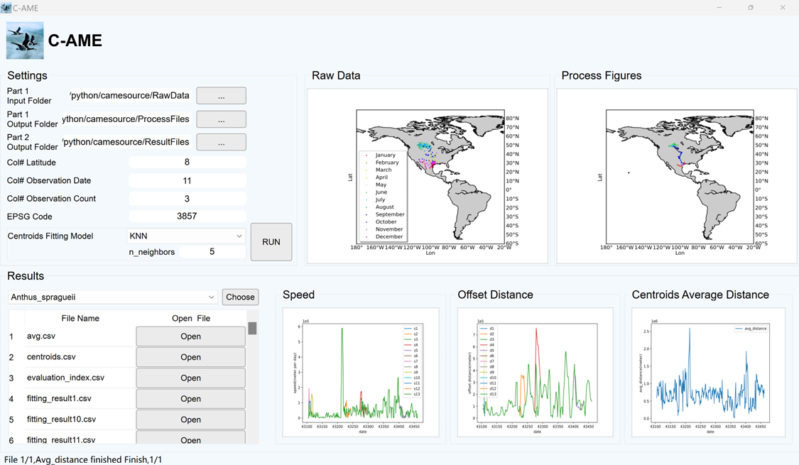

# C-AMEv1.1 <a href="https://colab.research.google.com/drive/1kOmRemx4p2Wqa2JtFeZtZNlCNiVo8zEc?usp=sharing"></a>
C-AME is an open-source Python software tool for avian migration trajectory estimation based on observation data.
We offer both a **Windows-only** application and the corresponding source code with its Google Colab link ready.
## C-AME Application Usage (Windows only)

1. **Download the Code**
   - Download the code located in the "application" folder and extract all files.
2. **Navigate and Determine Folder Paths**
   - Navigate into the `cameMain` folder.
   - Determine the following folder paths to organize your data:
     - Raw data folder (support for multiple files processing): Part 1 Input Folder
     - Data format standardization results folder: Part 1 Output Folder
     - Processing results storage folder: Part 2 Output Folder
   - Note that we have set the default folder 'Raw Data' as the Part 1 Input Folder with the raw observation data in it to reproduce our method, you need to set two empty folders, such as 'ProcessFiles' and 'ResultFiles', as Part 1 Output Folder and Part 2 Output Folder  before you run it. 
3. **Execute the Application**
   - Double click on the Application file named `cameMain.exe`, which is represented by a blue bird icon. This action will open the software terminal after a short while.
4. **Parameter Settings**
   - Set the three paths you determined in Step 2 within the terminal window.
   - Ensure you select the correct columns for the following data:
     - Latitude
     - Longitude
     - Observation date
     - Observation count
   - Note that we have set the default column numbers as follows:
     - Col# Latitude : Col# Observation Date = 8 : 11
     - Col# Observation Count= 3.
   -  Set the EPSG Code to define projection model:
     - The default value of EPSG: 3857.
   -  Choose the fitting model for grouped centroids:
     -  Three alternative models to choose from: Generalized Additive Model (GAM), Random Forests (RF), and K-Nearest Neighbors (K-NN). Meanwhile, we open up the number of trees(n_estimators; default value: 100)and randomness(random_state; default value: 42)in the Random Forests model, as well as the number of neighbors(n_neighbors; default value:5)  in K-NN for users to define according to the characteristics of their own data.
5. **Run the Application**
   - Click on the "RUN" button to execute the application.

## C-AME Source-code Usage 
[[API Documentation](https://shifengshierya.github.io/C-AME/)]

This part is recommended for developers. 
### Quick Start on Colab
We provide a [Colab Link](https://colab.research.google.com/drive/1kOmRemx4p2Wqa2JtFeZtZNlCNiVo8zEc?usp=sharing) of this code for a quick try. Run the code by clicking the triangle button from top to bottom.
### Environment
We use Python 3.10 for all the experiments. Install other dependencies via
```bash
pip install -r requirements.txt
```
### Data Preparation
The raw observation data can be organized into lists, including the species with observation counts, observation dates and locations (latitude and longitude). In our case, raw data for Anthus spragueii, a small songbird in North America, is acquired from eBird and saved in the Part 1 Input Folder for our case study. It includes 2169 records from 2018/1/1 to 2018/12/31, and organized into lists, including common name, scientific name, observation count, country, state, county, latitude, longitude, observation date, and so on. The software tool can also be applied to other time-series latitude and longitude observation data of migratory species from different observation databases, such as GBIF, iNaturalist, the researchers themselves, or integrated data from multiple data sources with the data organized into locations (latitude and longitude), observation dates, and observation counts. 

### Usage
Navigate into the source folder, and run 
```bash
python Part_1_data_format_standardization.py --input_dir {INPUT_DIR} --data_dir {DATA_DIR} --save_dir {SAVE_DIR} --obs_count {OBS_COUNT} --lat_col {LAT_COL} --obs_date {OBS_DATE} --projection {PROJECTION} 
```
where 
- `INPUT_DIR` refers to the directory of input data mentioned above (support for multiple files processing)
- `DATA_DIR` refers to data format standardization results folder
- `SAVE_DIR` refers to process results storage folder
- `OBS_COUNT` refers to the column number for observation count
- `LAT_COL` refers to the column number for latitude
- `OBS_DATE` refers to the column number for observation date
- `PRPJECTION` refers to the EPSG code

Then, you can get the results in the corresponding folders：
#### Result Files
| Item                               | Description                                                                               |
|:------------------------------------:|-------------------------------------------------------------------------------------------|
| `trajectories.jpg`                            | The migration trajectory estimation results                                                  |
| `off_distance` folder                | The offset distance calculation results and its figure <br> - `d1.csv`-`d13.csv`: the offset distance for each group <br> - `OffsetDistancePerDay.png`: the offset distance figure for the species|
| `speed` folder                       | The speed calculation results and its figure <br> - `s1.csv`-`s13.csv`: the speed for each group <br> - `SpeedPerDay.png`: the speed figure for the species|
| `ave_disatance.csv` & `avg_distance.png`| The average distance of daily centroids and its figure                                    |

#### Processing Files
|           Items           |                               Description                               |
|:-------------------------:|:-----------------------------------------------------------------------:|
|  Anthus_spragueii.csv     |                The result after data standardization                      |
|  Anthus_spragueii.jpg     |    The figure for raw observation data distribution                     |
|  initial_data.csv         |             The data after coordinates conversion            |
|  rolling_window_data.csv  |                The data after rolling window                            |
|  sldf.csv                 |             The data after SLDF outlier detection                       |
|  centroids.csv            |                  The centroids result by Meanshift algorithm            |
|  centroids_43110.jpg-centroids_43460.jpg | The centroids figure during clustering                   |
|  group1.csv-group13.csv     |              The results after centroid grouping                      |
|  gam1.jpg-gam13.jpg /  randomforest1.jpg-randomforest13.jpg/ KNN1.jpg-KNN13.jpg   |        The fitting process figures with GAM/RF/K-NN algorithm      |
|  fiiting_result1.csv-fitting_result13.csv       | The fitting results after GAM/RF/KNN algorithm       |

